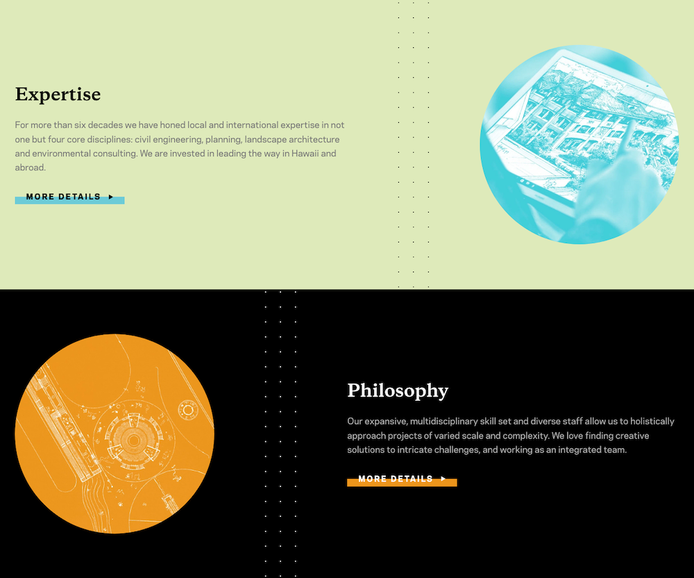
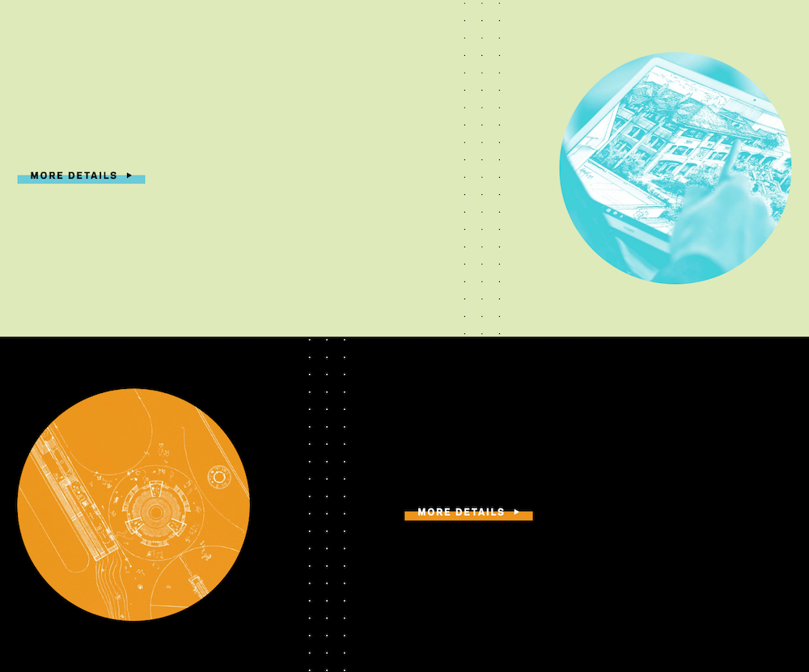
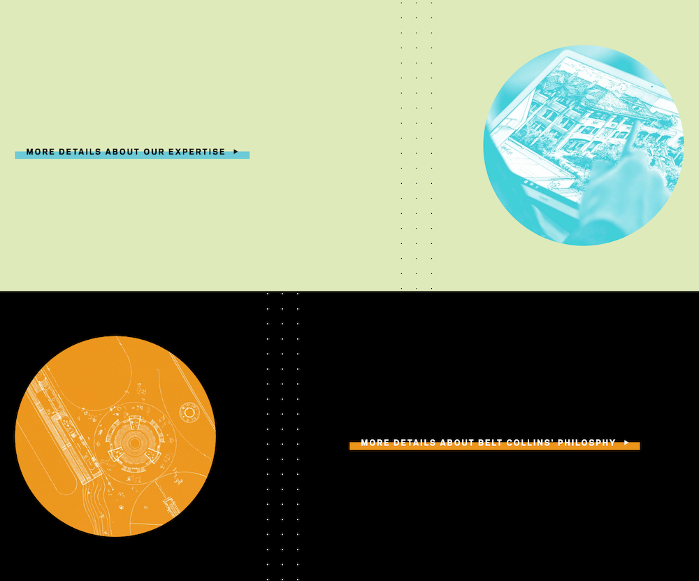

import { Callout } from 'reference'

In order to maintain an ADA compliant website, content editors must ensure that
their changes do not accidentally discriminate against or exclude people with
disabilities. This article will provide Wall-to-Wall's recommended best
practices for ADA compliance.

<Callout type="info">

**Note:** The Internet and ADA compliance are fluid standards, so these
guidelines may not currently encompass new developments or technologies.

Additional breakdowns of specific guidelines can be found in WCAG, a set of
accessibility standards determined by World Wide Web Consortium.

</Callout>

# Image Alt Text

When adding new images to the Media Library, always remember to enter a
summarized description of the image. Descriptions allow screen reader users to
glean the intent of images on a page.

<Callout type="warning">

**Image Text:** If the image you are adding contains text and that text is
required to convey the meaning of the image to the reader, then the alt text
must contain **all** the text in the image.

</Callout>

# Link Descriptions

Non-visually impaired users can typically derive a link's purpose by using other
adjacent text and elements around it as context.

Screen reader users lack the ability to tie these visual relationships together,
so it's difficult for these users to differentiate between two button links that
have identical text.

Consider the following example and note how both button links have the same
text:

As visual users, we are able to intuitively derive the purpose of the "More
Details" buttons by utilizing the headings and body text surrounding them.

Now imagine if we saw this instead:

How would we know where these links directed us to? **This is effectively what
screen readers "see" when navigating a page**.

## Fixing The Problem

How can we retain the visual appeal of short & concise buttons while still
providing verbose link purpose? With _button descriptions!_

_Button descriptions_ are accessibility friendly CMS fields that will signal to
screen readers what a link's purpose is. Building off our previous example, an
appropriate _button description_ would read something like:

**_"More details about our Expertise."_** or **_"More details about Belt
Collin's philosophy."_**

Using our visual metaphor again, our button links would appear like this for
screen readers _only_:

Much better! The screen reader user now knows exactly what will happen when they
interact with that link. When authoring slices in the CMS, be sure to provide
accurate descriptions for your links when you see the _Button Description_
field.

<Callout heading="When Is This Important?" type="warning">

As discussed above, _Button Description_ fields are particularly important when
there are multiple links with identical _Button Text_ on the same **Page**.

Not all slices include a Button Description field. In those cases, be sure to
provide descriptive text in the main button text.

</Callout>

# Color Contrast

Make sure that your visuals have enough contrast and color to be easily
identifiable and distinguishable. This requirement isn’t very intensive, but
when uploading new media, be sure that your image is clear and that text has
enough contrast to be easily legible.

Within the documentation for individual slices, the **Recommendations** sections
will let you know if there are contrast considerations when selecting an image
or text color.
