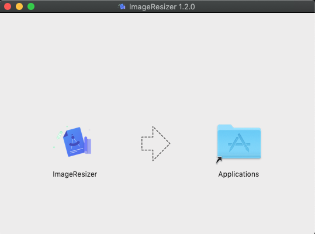
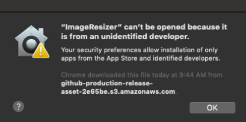
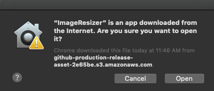
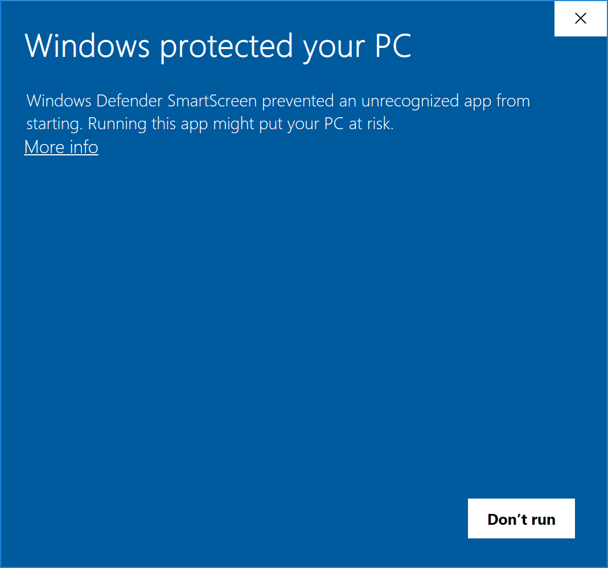

import { LinkCard, LinkCardList, Callout } from 'reference'

<Callout heading="Beta">

This app is in beta! Please keep in mind some functionality may not be 100%
working.

</Callout>

# Download

You can download the Image Resizer application with one of the following links:

<LinkCardList>

<LinkCard
  href="https://github.com/asyarb/ImageResizer/releases/download/v1.2.0/image-resizer-setup-1.2.0.exe"
  title="Windows"
>
  Image Resizer for Windows.
</LinkCard>

<LinkCard
  href="https://github.com/asyarb/ImageResizer/releases/download/v1.2.0/ImageResizer-1.2.0.dmg"
  title="Mac"
>
  Image Resizer for macOS.
</LinkCard>

</LinkCardList>

# Install instructions

Follow the instructions appropriate for your platform:

## Mac

1. Open the **.dmg** file from the download link above. Once the .dmg opens, you
   should see the following window:

2. Drag the **ImageResizer** icon into the **Applications** folder.
3. After a short delay, the ImageResizer app should successfully install.
4. Open your **Applications** folder normally and click on the newly added
   ImageResizer icon. You will see the following window:

5. This is a temporary beta bug, so click on **OK** for now.
6. Using the same ImageResizer icon you clicked in step 4, hold **Control**
   before clicking on the icon. You should now see a slightly different window:

7. Click on **Open** and the Image Resizer app should open!

## Windows

1. Download the **.exe** from the link above. In some browsers, you may receive
   a warning like shown below:

2. This is a temporary beta bug. Click on the down arrow and select **Keep**.
3. Once the .exe finishes downloading, click on it (or run it from your
   downloads folder) to install the app. You may see the following:

4. This is a **beta bug**. Click on the More Info text then click **Run
   anyway**.
5. A small window with an installation progress bar will appear. Once it
   completes, the ImageResizer app should launch!
